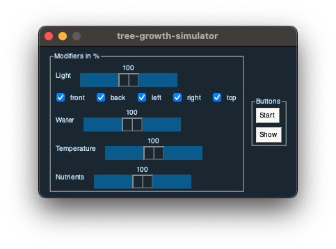
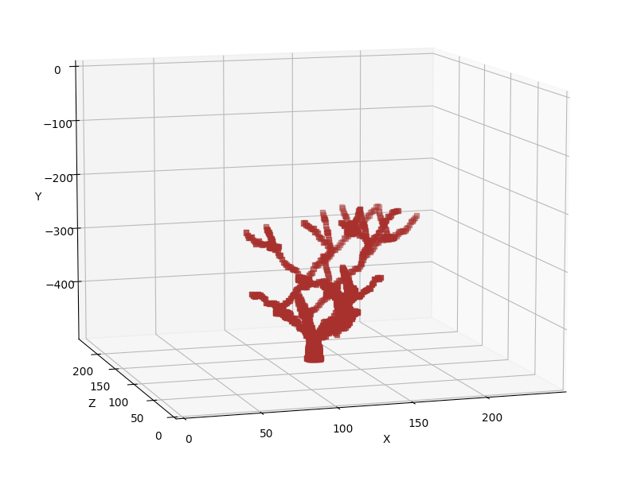
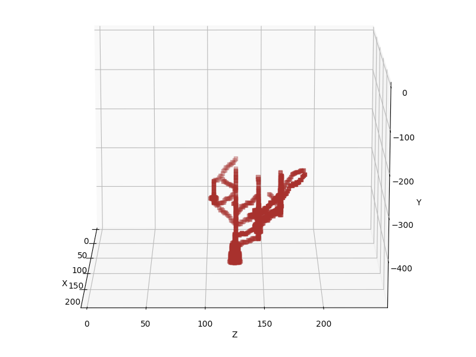
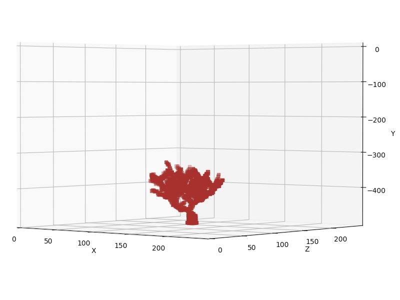

# tree-growth-simulator
Generate a 3d tree model which is made based of off different environmental factors.

## graphical userinterface
- set intensity of environmental factors
- start the simulation
- show the result

## results
### default settings

### light 100% only right

### water 50%
