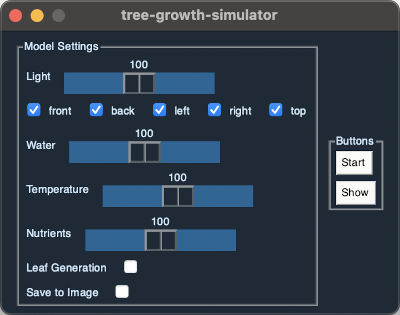

# tree-growth-simulator
Generate a 3d tree model which is made based of off different environmental factors.

## Usage
Setup:
- git clone -b stable https://github.com/philipp-schuetz/tree-growth-simulator
- pip install -r requirements.txt

Run:
- run main.py in /src

## Graphical User Interface
- set intensity of environmental factors
- enable/disable generation of leaves
- start the simulation
- show the result

## Logging
- certain events are logged in 'logfile.log'

## Results
### Default Settings

### Light 100% (only right light source)

### Water 50%

