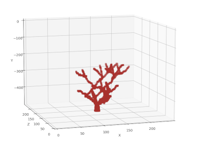

# tree-growth-simulator
Generate a 3D tree model that is based on different environmental factors.

## Usage
### Executable
Just download the executable for your system from the [latest release](https://github.com/philipp-schuetz/tree-growth-simulator/releases/latest).

### Python (Version 3.11 is recommended)
Setup:
- `git clone -b stable https://github.com/philipp-schuetz/tree-growth-simulator`
- `pip install -r requirements.txt`

Run:
- run main.py in /src

### Web API
The API provides a web interface for generating the tree models.
A local installation of the tree-growth-simulator is therefore not required.
</br>
Visit the API docs here: [https://tgs.philippschuetz.com/docs](https://tgs.philippschuetz.com/docs)
</br>
You can also host a version of the API yourself with Docker. Build the image with `docker build -t tgs-img .` and run the container with `docker run -p 80:80 tgs-img`.
After the container is started, the docs can be accessed here: [http://127.0.0.1/docs](http://127.0.0.1/docs)
## Graphical User Interface
Through the GUI, you can set the intensity of environmental factors, image creation of the results, start the simulation and show its results.
If image creation is enabled, the images are created when clicking the show button and saved in a folder named plots.

### Example image of the GUI:


## Config
With the help of the config file, even more settings can be adapted to your needs. The default configuration will be created on application startup in `config.json`. After an update, you might want to backup your current configuration and regenerate it by starting the updated app to get the newest configuration options.

### Material ID
The material id is the number used to identify each material in the numpy model array.
```json
"material_id": {
    "air": 0,
    "wood": 1,
    "leaf": 2,
    "wall": 3
}
```

### Material Translucency
Material describes the translucency of each material and can therefore be used to influence the light calculation.
```json
"material_translucency": {
        "air": 100,
        "wood": 0,
        "leaf": 50,
        "wall": 0
}
```

### Model Dimensions
By changing the width and height of the model, the size of the 3D array is changed.
```json
"model_dimensions": {
    "width": 249,
    "height": 498
},
```

### Visualization
With the visualization options, the material colors used for plotting and the filename of the plot images can be changed.
```json
"visualization": {
    "material_colors": {
        "wood": "brown"
    },
    "plot_filename": "plot"
}
```

### Modifiers
This setting can be used to better control the behavior of the different modifier values. In this example, the minimum value needed to start generation for each of the modifiers is set to 20 percent.
```json
"light": {"minimum": 20}
"water": {"minimum": 20}
"temperature": {"minimum": 20}
"nutrients": {"minimum": 20}
```

### Miscellaneous
The `logging` value can be changed to either enable or disable logging.</br>
The value of `random_seed` can be set to `false` or `any integer`. If the value is set to an integer, it is used as the seed for any random number generator in the program. When set to false, the system time is used as the seed.
When changing the boolean value of `save_array` to `true` the array created on runtime is saved to a file, `model_array.npy` by default.
```json
"logging": true
"random_seed": false
"save_array": false
```

## Logging
If logging is enabled in the configuration file, certain events are logged to a file. This file is called `logfile.log` by default. These events can include information about a finished process or error messages. This information is mainly used for debugging.

## Example Results
### Default Settings


### Light 100% (only right light source)


### Water 50%


## License
Licensed under the [GPL-3.0](https://github.com/philipp-schuetz/tree-growth-simulator/blob/master/LICENSE) license.
